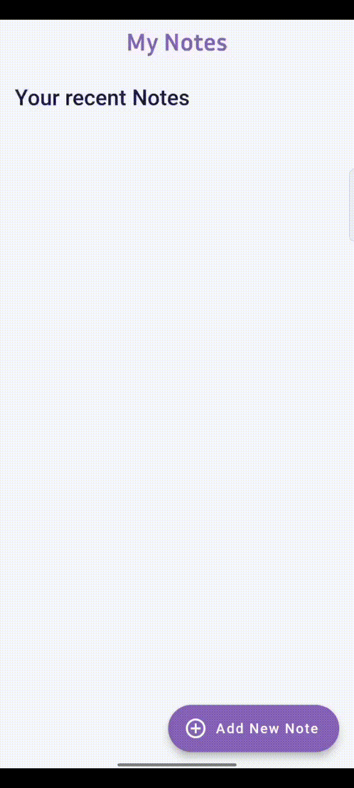
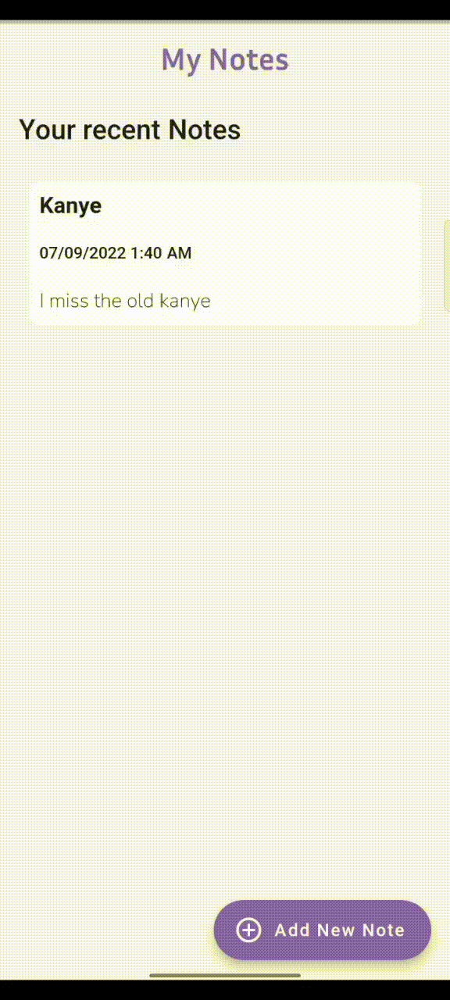
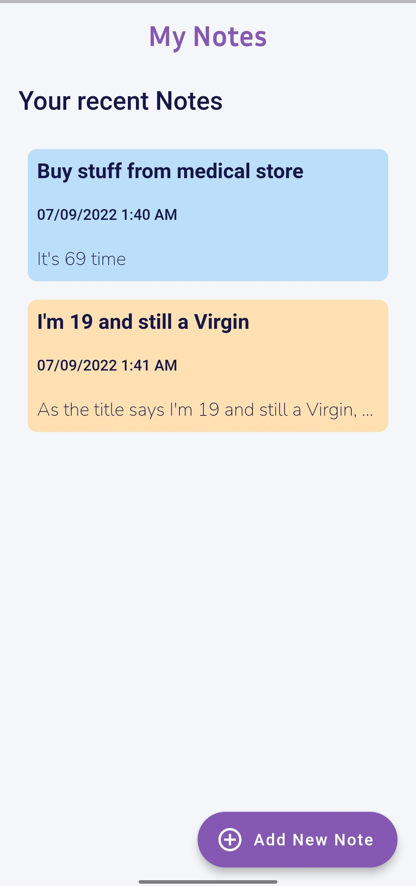
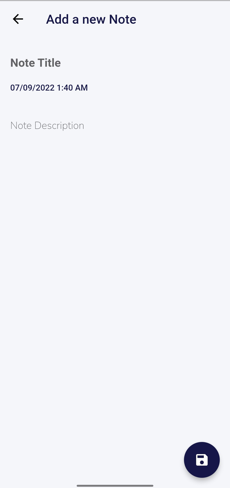

# Notex

A new FlutterFire Crud App to note.


## Installation 


You can clone by copy and pasting below commands in your Terminal.

```bash 
    git clone https://github.com/darshn-n/notex/
    cd notex
    flutter run
```


Libraries used in the project
```yaml
  cupertino_icons: ^1.0.2
  firebase_core: ^1.21.1
  cloud_firestore: ^3.4.6
  date_format: ^2.0.6
  intl: ^0.17.0
  google_fonts: ^3.0.1
```

## Screenshots

&nbsp;&nbsp;&nbsp;  &nbsp;&nbsp;&nbsp; 
 &nbsp;&nbsp;&nbsp;


  

### That's it
```
	Voila
```
